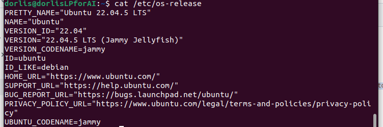
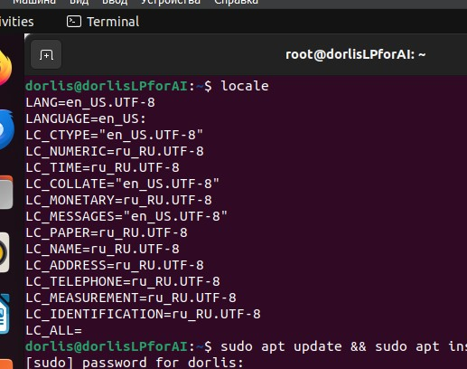
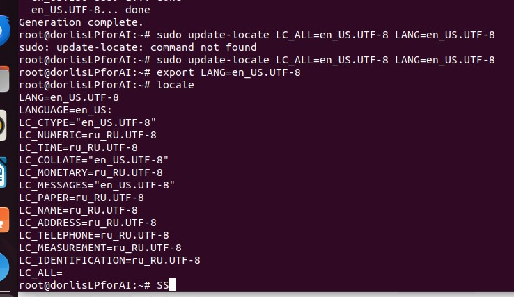
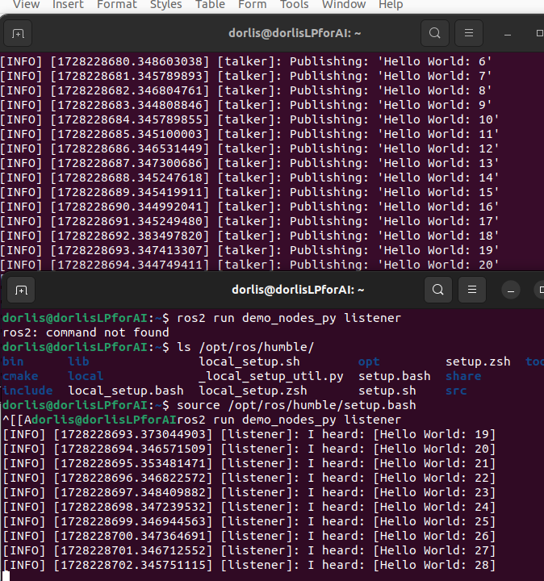

# Языка программирования для задач искусственного интеллекта
Доренская Елизавета Артёмовна, НПИмд-01-24

## Лабораторная работа №2

#### Задание:
- Установить ROS2 Humble
- Изучить планировщик Pyperplan [Pyperplan Github](https://github.com/aibasel/pyperplan)
- Построить модель среды с tb3 (4) с манипулятором, либо любой другой колесный робот с манипулятором [E-manual for tb3](https://emanual.robotis.com/docs/en/platform/turtlebot3/overview/)
- Создать ROS узел с планировщиком.

### Немного теории:
-**ROS2 (Robot Operating System 2)** — это открытая платформа для разработки программного обеспечения в области робототехники, которая предоставляет набор инструментов и библиотек для создания сложных роботизированных систем. ROS2 улучшает возможности своего предшественника, ROS, добавляя поддержку реального времени, улучшенную межпроцессорную связь и возможность работы на различных аппаратных платформах. Он основан на архитектуре узлов, где каждый узел может обмениваться сообщениями через топики, что позволяет разработчикам легко интегрировать различные компоненты и модули в своих проектах. ROS2 широко используется в научных исследованиях, промышленности и образовательных учреждениях для создания и управления роботами.

### Подготовительная работа:
- Для выполнения лабораторной работы мной было приняно решение работать Ubuntu (версия 22.04 с графическим интерфейстом). Для этого нужно было скачать iso-образ с официального сайта Ubuntu, а также скачать Oracle VM VirlualBox, чтобы запустить виртуальную машину.
  
- Выбор среды был связан с тем, что ROS2 (Robot Operating System 2) официально поддерживается на Ubuntu, что обеспечивает совместимость и стабильность. Многие инструменты и библиотеки для робототехники, включая Pyperplan, часто разрабатываются с учетом работы на Ubuntu. Также для установки ROS2 можно легко ввести команды в терминале, что очень упрощает процесс.

Результат выполнения:<br /> 


### Установка ROS2 Humble:
- Проверка локали и установка необходимых пакетов:
```bash
locale  # check for UTF-8
sudo apt update && sudo apt install locales
sudo locale-gen en_US en_US.UTF-8
sudo update-locale LC_ALL=en_US.UTF-8 LANG=en_US.UTF-8
export LANG=en_US.UTF-8
locale  # verify settings
```

Проверка текущие настройки локали системы до изменений:<br />


Проверка текущие настройки локали системы после изменений (по факту ничего не поменялось, все было так, как нужно):<br />
<br />
Ремарка: сначала меняла настройки через администратора root, потому что от моего имя вылетала ошибка доступа, но потом добавила своего пользователя и назначила ему права администратора и все стало хорошо.

- Установка пакета для управления репозиториями:
```bash
sudo apt install software-properties-common
```

- Добавление репозитория ROS2:
```bash
sudo add-apt-repository universe
```

- Добавление ключа для пакетов ROS2:
```bash
sudo apt update && sudo apt install curl -y
sudo curl -sSL https://raw.githubusercontent.com/ros/rosdistro/master/ros.key -o /usr/share/keyrings/ros-archive-keyring.gpg
```

- Добавление источника пакетов ROS2:
```bash
echo "deb [arch=$(dpkg --print-architecture) signed-by=/usr/share/keyrings/ros-archive-keyring.gpg] http://packages.ros.org/ros2/ubuntu $(. /etc/os-release && echo $UBUNTU_CODENAME) main" | sudo tee /etc/apt/sources.list.d/ros2.list > /dev/null
```
 
- Обновление списка пакетов и установка ROS2:
```bash
sudo apt update
sudo apt upgrade
```

- Установка полного рабочего стола ROS2:
```bash
sudo apt install ros-humble-desktop-full
```
 
- Установка базовых компонентов ROS2:
```bash
sudo apt install ros-humble-ros-base
sudo apt install ros-dev-tools
```

- Настройка окружения:
```bash
source /opt/ros/humble/setup.bash
```

- Тестирование Talker и Listener: <br/>

В одном терминале и запуск Talker:
```bash
source /opt/ros/humble/setup.bash
ros2 run demo_nodes_cpp talker
```

В другом терминале запуск Listener:
```bash
source /opt/ros/humble/setup.bash
ros2 run demo_nodes_py listener
```

Результат выполнения:<br /> 


После завершения установки мы запускаем два узла: Talker и Listener. Talker отправляет сообщения в определённый топик, а Listener подписывается на этот топик и принимает сообщения, что позволяет продемонстрировать механизм обмена данными между узлами в ROS2. Этот процесс иллюстрирует основные принципы работы с системой ROS2, включая публикацию и подписку на сообщения, что является важным аспектом разработки распределённых приложений в робототехнике.


<!--- 

### 2. Изучить планировщик Pyperplan [Pyperplan Github](https://github.com/aibasel/pyperplan):
- Просматривая документацию по pyperplan, я клонировал его в свою виртуальную среду и установил зависимости. Либо просто выполните ```pip install pyperplan```. <br>
<br>

<br>
- Затем я посмотрел на флаги и структуру pyperplan, чтобы проверить, смогу ли я запустить тест внутри него. <br>
<br>

<br>
- Наконец, я провел тест, чтобы убедиться, что pyperplan работает, запустив домен и задачу. <br>
<br>

<br>

### 3- Построить модель среды с tb3 (4) с манипулятором, либо любой другой колесный робот с манипулятором [E-manual for tb3](https://emanual.robotis.com/docs/en/platform/turtlebot3/overview/)
- Я установил TurtleBot3 с его зависимостями и симуляциями из исходного кода, чтобы убедиться, что не будет никаких проблем. После завершения всех шагов в документации я запустил TurtleBot3 с моделью MODEL=waffle внутри Gazebo в пустом мире, чтобы убедиться, что после этого шага смогу просто запустить его с манипуляторной рукой. <br>
<br>

<br>
- Затем я установил зависимости для манипуляторной руки на TB3 Waffle и запустил её в среде машинного обучения.
<br>

<br>

### 4- Создать ROS узел с планировщиком.
- Прочитав несколько документаций в интернете, я создал базовый узел ROS2, который просто использует pyperplan без инструкций, чтобы показать, что pyperplan запускается, затем узел вращается и корректно завершает работу. <br>
<br>

<br>

```python
#!/usr/bin/env python3

import rclpy
from rclpy.node import Node
import pyperplan
from rclpy.executors import SingleThreadedExecutor

class SimpleNode(Node):
    def __init__(self):
        super().__init__('pyperplan_node')
        self.get_logger().info('pyperplan is ready on machine doruk@dorukvn...')

        '''
        Here goes the domain and the test etc...
        '''

        self.create_timer(2.0, self.cleanShutdown)
    
    def cleanShutdown(self):
        self.get_logger().info('shutting down')
        rclpy.shutdown()

def main(args=None):
    rclpy.init(args=args)
    node = SimpleNode()
    executor = SingleThreadedExecutor()
    executor.add_node(node)
    try:
        executor.spin()
    except KeyboardInterrupt:
        node.get_logger().info('shutting down: Ki')
    finally:
        node.get_logger().info('cleaning up...')
        executor.shutdown()
        node.destroy_node()

if __name__ == '__main__':
    main()
```
 --->
