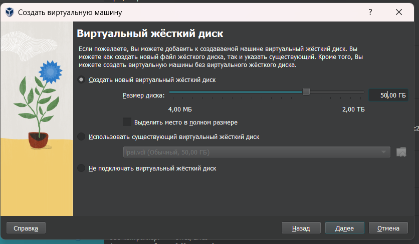

# Языка программирования для задач искусственного интеллекта
Доренская Елизавета Артёмовна, НПИмд-01-24

## Лабораторная работа №2

#### Задание:
- Установить ROS2 Humble
- Изучить планировщик Pyperplan [Pyperplan Github](https://github.com/aibasel/pyperplan)
- Построить модель среды с tb3 (4) с манипулятором, либо любой другой колесный робот с манипулятором [E-manual for tb3](https://emanual.robotis.com/docs/en/platform/turtlebot3/overview/)
- Создать ROS узел с планировщиком.

### Немного теории из интернета:
- *ROS2 (Robot Operating System 2)* — это открытая платформа для разработки программного обеспечения в области робототехники, которая предоставляет набор инструментов и библиотек для создания сложных роботизированных систем. ROS2 улучшает возможности своего предшественника, ROS, добавляя поддержку реального времени, улучшенную межпроцессорную связь и возможность работы на различных аппаратных платформах. Он основан на архитектуре узлов, где каждый узел может обмениваться сообщениями через топики, что позволяет разработчикам легко интегрировать различные компоненты и модули в своих проектах. ROS2 широко используется в научных исследованиях, промышленности и образовательных учреждениях для создания и управления роботами.

### Подготовительная работа:
- Для выполнения лабораторной работы мной было приняно решение работать Ubuntu (версия 22.04 с графическим интерфейстом). Для этого нужно было скачать iso-образ с официального сайта Ubuntu (с графическим интерфейсом), а также скачать Oracle VM VirlualBox, чтобы запустить виртуальную машину.
- 
VirtualBox — это программное обеспечение для виртуализации, которое позволяет запускать несколько операционных систем на одном компьютере.

  **Процесс "накатывания" виртуальной машины (ВМ):**
1. В VirtualBox нажимаем кнопку "Создать"
   
2. Придумываем имя виртуальной машины, выбираем папку, где будет располагаться ВМ и выбираем скаченный iso-образ. Затем нажимаем "Далее"
   
3. Придумывем имя пользователя, пароль, имя хоста, и доменное имя (на ход лабораторной это почти никак не повлияет, но на будущее пригодится). Затем нажимаем "Далее"
   
4. Теперь выбираем оборудование. Оперативной памяти берем минимум 4 ГБ или же 4096 МБ, иначе ничего гружиться не будет. И количество процессоров можно оставить 1, но я взяла 3 (Хотя по личному опыту скажу, что роли это вообще никакой не играет, все равно виснет). Затем нажимаем "Далее"
   
5.  Проверяем настройки и нажимаем "Готово". Машина создана.
   
   
7. Ждем загрузки. Это долгий процесс...
8. Самое главное в это процессе не обновлять систему (потому что потом лаба просто не будет работать) и если перейти в "Settings"->"Region and Languages"->"Login Screen", то там надо поменять язык на English (United States) без дальнейших приписей, например, как у меня [ISO-8859-1] (это уже для того, чтобы терминал запустился)
9. Перезапускаем машину и все... Можно работать
8а. Опционально, но потом облегчит жизнь-назначение прав на своего пользователя
Позже надо будет провести махинации с кодировкой, но в режиме пользователя это не сделать, прав нет. Для этого в терминале мы вводим команду, чтобы войти в режим суперпользователя.
```bash
su -
```
После ввода пароля (который придумывали ранее) нас перекидывает в режим root. Затем вводим команду для редактирования прав.
```bash
visudo
```
и в огромном текстовом файле находим раздел "# User privillege specification"
ниже надо прописать строку аналогичную строке root ALL=(ALL:ALL) AL, но вместо root пишем имя пользователя. Это даст нам полные права на все. Нажимем соченание Ctrl+X, затем Y (или yes - это подтверждение сохранения) и enter. 
На этом с установкой все.

- Выбор среды был связан с тем, что ROS2 (Robot Operating System 2) официально поддерживается на Ubuntu, что обеспечивает совместимость и стабильность. Многие инструменты и библиотеки для робототехники, включая Pyperplan, часто разрабатываются с учетом работы на Ubuntu. Также для установки ROS2 можно легко ввести команды в терминале, что очень упрощает процесс.

Результат выполнения:<br /> 


### Установка ROS2 Humble:

Есть официальный сайт https://docs.ros.org/en/humble/index.html , благодаря которому можно настроить ROS2 Humble себе на ВМ. Но для удобства шаги будут откражены тут.
Также мне очень помогло это видео https://rutube.ru/video/6be727857c7a9bb44e7e6995d7570839/?r=wd

- Проверка локали и установка необходимых пакетов:
```bash
locale  # check for UTF-8
sudo apt update && sudo apt install locales
sudo locale-gen en_US en_US.UTF-8
sudo update-locale LC_ALL=en_US.UTF-8 LANG=en_US.UTF-8
export LANG=en_US.UTF-8
locale  # verify settings
```
Локаль - это набор данных указывающий на формат даты и времени, отображение валют, используемый язык и другие данные. например en_US указывает на то что это американский английский язык. Кодировка указывается через точку и en_GB.UTF-8 - значит что клиентское ПО должно выводить текст на британском английском используя кодировку UTF-8.<br />
Эти команды обеспечивают использование кодировки UTF-8 вашей системой, что критично для многих приложений, включая ROS2.


Проверка текущие настройки локали системы до изменений:<br />


Проверка текущие настройки локали системы после изменений (по факту ничего не поменялось, все было так, как нужно):<br />
<br />

Проверяем, что репозиторий Ubuntu Universe включен.
Ubuntu Universe — это один из компонентов репозиториев программного обеспечения в операционной системе Ubuntu. Он включает в себя большое количество пакетов, которые не поддерживаются официально, но предоставляют пользователям доступ к дополнительным приложениям и инструментам.
Репозиторий Universe содержит пакеты, поддерживаемые сообществом, которые могут быть необходимы для установки ROS2.

- Установка пакета для управления репозиториями:
```bash
sudo apt install software-properties-common
```

- Добавление репозитория ROS2:
```bash
sudo add-apt-repository universe
```

- Добавление ключа для пакетов ROS2
GPG (Gnu Privacy Guard) в контексте ROS 2 — это система, используемая для проверки подлинности и целостности пакетов и репозиториев, связанных с Robot Operating System 2 (ROS 2). Она помогает убедиться, что программное обеспечение, которое вы устанавливаете, не было изменено и действительно поступает от надежного источника

```bash
sudo apt update && sudo apt install curl -y
sudo curl -sSL https://raw.githubusercontent.com/ros/rosdistro/master/ros.key -o /usr/share/keyrings/ros-archive-keyring.gpg
```
Curl используется для загрузки файлов по URL; добавление ключа позволяет вашей системе аутентифицировать пакеты из репозиториев ROS.

- Добавление источника пакетов ROS2:
```bash
echo "deb [arch=$(dpkg --print-architecture) signed-by=/usr/share/keyrings/ros-archive-keyring.gpg] http://packages.ros.org/ros2/ubuntu $(. /etc/os-release && echo $UBUNTU_CODENAME) main" | sudo tee /etc/apt/sources.list.d/ros2.list > /dev/null
```
Эта команда добавляет репозиторий пакетов ROS2 в вашу систему, позволяя устанавливать пакеты ROS2 напрямую.

- Обновление списка пакетов и установка ROS2:
```bash
sudo apt update
sudo apt upgrade
```
Обновление списка пакетов гарантирует доступ к последним версиям всех установленных пакетов.

- Установка полного рабочего стола ROS2 (тут небольшое расхождение с сайтом, потому что там скачиваются не все пакеты для работы):
```bash
sudo apt install ros-humble-desktop-full
```
Пакет desktop-full включает все необходимые компоненты для использования ROS2 с графическим интерфейсом.

- Установка базовых компонентов ROS2:
```bash
sudo apt install ros-humble-ros-base
sudo apt install ros-dev-tools
```
Эти пакеты необходимы для базовой функциональности и инструментов разработки в ROS2.

- Настройка окружения:
```bash
source /opt/ros/humble/setup.bash
```
Эта команда настраивает переменные окружения для ROS2, позволяя использовать его команды в вашем терминале.

- Тестирование Talker и Listener: <br/>

В одном терминале и запуск Talker:
```bash
source /opt/ros/humble/setup.bash
ros2 run demo_nodes_cpp talker
```

В другом терминале запуск Listener:
```bash
source /opt/ros/humble/setup.bash
ros2 run demo_nodes_py listener
```

Результат выполнения:<br /> 


После завершения установки мы запускаем два узла: Talker и Listener. Talker отправляет сообщения в определённый топик, а Listener подписывается на этот топик и принимает сообщения, что позволяет продемонстрировать механизм обмена данными между узлами в ROS2. Этот процесс иллюстрирует основные принципы работы с системой ROS2, включая публикацию и подписку на сообщения, что является важным аспектом разработки распределённых приложений в робототехнике.


### Изучение планировщика Pyperplan [Pyperplan Github](https://github.com/aibasel/pyperplan):
- В документации прописано, что установить Pyperplan можно либо клонировав репозиторий, либо использовав команду ```pip install pyperplan```. Я решила воспользоваться 2ым способом, предварительно скачаа пакеты python

- Посмотреть подробную информацию о планировщике (как его запустить) можно выполнив команду:
```bash
pyperplan --help
```
или проще 
```bash
pyperplan -h
```

- Далее, чтобы убедиться, что pyperplan работает, можно запустить домен и задачу. <br />
 
Результат выполнения:<br /> 


### Построение модели среды с tb3 (4) с манипулятором

### Немного теории из интернета:<br /> 
-*TurtleBot3* — это небольшой, доступный и программируемый мобильный робот, основанный на Robot Operating System (ROS), предназначенный для использования в образовании, исследованиях, хобби и прототипировании продуктов. Разработанный компанией ROBOTIS, TurtleBot3 предлагает модульную конструкцию и возможность настройки, что позволяет пользователям адаптировать его под различные задачи. Он оснащён датчиками LiDAR и 3D, что позволяет ему автономно перемещаться и выполнять задачи, такие как одновременная локализация и картографирование (SLAM). TurtleBot3 доступен в нескольких моделях, включая "Burger" и "Waffle", каждая из которых имеет свои особенности и возможности для расширения.

- Я установила TurtleBot3 с его зависимостями и симуляциями из исходного кода, чтобы убедиться, что не будет никаких проблем. После завершения всех шагов в документации я запустила TurtleBot3 с моделью MODEL=waffle внутри Gazebo в пустом мире, чтобы убедиться, что после этого шага смогу просто запустить его с манипуляторной рукой. <br />
 <br />
 <br />

- Команды для установки
```bash
sudo apt install ros-humble-gazebo-*
sudo apt install ros-humble-cartographer
sudo apt install ros-humble-cartographer-ros
sudo apt install ros-humble-navigation2
sudo apt install ros-humble-nav2-bringup
```
Эти пакеты предоставляют возможности симуляции (Gazebo), картографирования (Cartographer) и навигации для роботов TurtleBot3.

```bash
mkdir -p ~/turtlebot3_ws/src
cd ~/turtlebot3_ws/src/
git clone -b humble-devel https://github.com/ROBOTIS-GIT/DynamixelSDK.git
git clone -b humble-devel https://github.com/ROBOTIS-GIT/turtlebot3_msgs.git
git clone -b humble-devel https://github.com/ROBOTIS-GIT/turtlebot3.git
cd ~/turtlebot3_ws
colcon build --symlink-install
echo 'source ~/turtlebot3_ws/install/setup.bash' >> ~/.bashrc
source ~/.bashrc

echo 'export ROS_DOMAIN_ID=30 #TURTLEBOT3' >> ~/.bashrc
source ~/.bashrc

cd ~/turtlebot3_ws/src/
git clone -b humble-devel https://github.com/ROBOTIS-GIT/turtlebot3_simulations.git
cd ~/turtlebot3_ws && colcon build --symlink-install

- launch turtlebot3
source /usr/share/gazebo/setup.sh
export TURTLEBOT3_MODEL=waffle
ros2 launch turtlebot3_gazebo turtlebot3_world.launch.py
```
Эта команда запускает симуляцию TurtleBot3 в Gazebo с указанной моделью (waffle).

- Затем я установила зависимости для манипуляторной руки на TB3 Waffle и запустил её в среде машинного обучения.
Скринжот получился не совсем информативный, поскольку виртуальной машине не хватает оперативки для работы в программе.
 <br />


### 4- Создать ROS узел с планировщиком.
- Прочитав несколько документаций в интернете, я создала базовый узел ROS2, который просто использует pyperplan без инструкций, чтобы показать, что pyperplan запускается, затем узел вращается и корректно завершает работу. <br>

Результат выполнения: <br />
 <br />
 <br />
 <br />
 <br />

